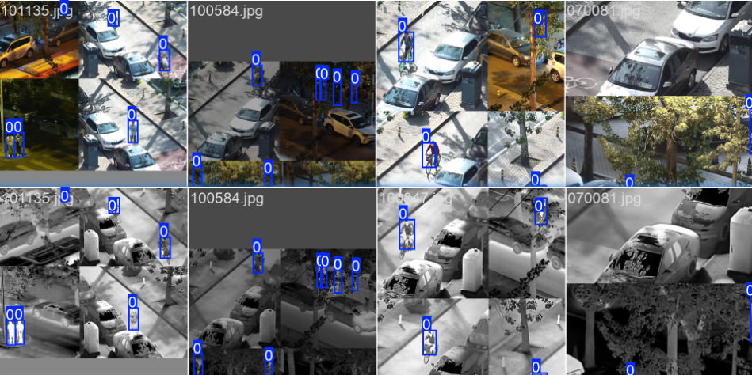
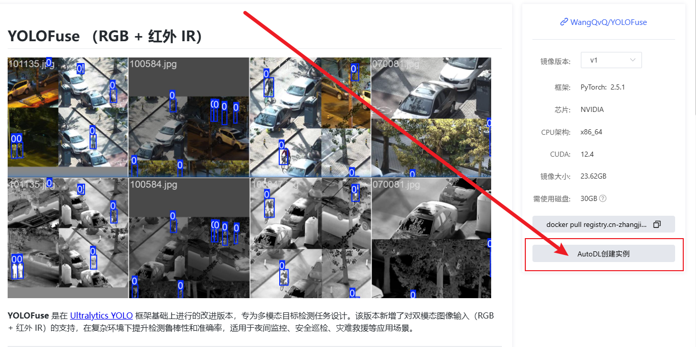

<p align="center"><a href="README_en.md">English</a></p>


<p align="center">
  <a href="https://github.com/WangQvQ/YOLOFuse">
    
  </a>
  <a href="https://github.com/WangQvQ/YOLOFuse">
    
  </a>
  <a href="https://github.com/WangQvQ/YOLOFuse/blob/main/LICENSE">
    
  </a>
  <a href="https://github.com/WangQvQ/YOLOFuse">
    
  </a>
  <a href="https://www.codewithgpu.com/i/WangQvQ/YOLOFuse/YOLOFuse">
    
  </a>
</p>


# YOLOFuse：面向多模态目标检测的双流融合框架

<p align="center">
  
</p>

**YOLOFuse** 是基于 [Ultralytics YOLO](https://github.com/ultralytics/ultralytics) 框架构建的增强型目标检测系统，专为多模态感知任务设计。本框架创新性地引入双流处理架构，支持RGB与红外（IR）图像的协同分析与特征融合，显著提升复杂环境（低照度、烟雾遮挡、极端天气等）下的检测鲁棒性。适用于安防监控、灾害救援、工业巡检等关键场景。

---

## ✨ 技术特性

* 🚀 **异构数据融合**：实现RGB与IR图像（可扩展至RGB-D等模态）的端到端联合处理
* 🔧 **兼容YOLOv8 API**：保留原生接口规范，确保用户迁移成本最小化
* 🔍 **可扩展融合模块**：提供多层次融合策略，支持：
  - ✅ 数据级融合（Data-level Fusion）
  - ✅ 决策级融合（Decision-level Fusion）
  - ✅ 早期特征融合（Early-level Feature Fusion）
  - ✅ 中期特征融合（Mid-level Feature Fusion）
  - ✅ 极简融合（Easy-level Feature Fusion）
  - ✅ DEYOLO（[arxiv](https://arxiv.org/abs/2412.04931)）

---

## 📊 LLVIP基准测试结果

<p align="center">


| 模型架构               | 模态     | 精度 (P) | 召回率 (R) | mAP\@50 | mAP\@50:95 | 模型大小 (MB) | 计算量 (GFLOPs) |
| ------------------ | ------ | ------ | ------- | ------- | ---------- | --------- | ------------ |
| YOLOv8n (baseline) | RGB    | 0.888  | 0.829   | 0.891   | 0.500      | 6.20      | 8.1          |
| YOLO-Fuse-中期特征融合   | RGB+IR | 0.951  | 0.881   | 0.947   | 0.601      | 2.61      | 3.2          |
| YOLO-Fuse-早期特征融合   | RGB+IR | 0.950  | 0.896   | 0.955   | 0.623      | 5.20      | 6.7          |
| YOLO-Fuse-决策级融合    | RGB+IR | 0.956  | 0.905   | 0.955   | 0.612      | 8.80      | 10.7         |
| YOLO-Fuse-极简融合     | RGB+IR | 0.899  | 0.865   | 0.939   | 0.620      | 7.83      | 8.5          |
| DEYOLO             | RGB+IR | 0.943  | 0.895   | 0.952   | 0.615      | 11.85     | 16.6         |


---

## 🧩 数据输入规范

系统通过文件名自动关联异构数据源，需确保文件命名一致性：

```
数据集目录/
├── images/        # RGB图像
│   └── 120270.jpg 
└── imagesIR/      # 红外图像（同级目录）
    └── 120270.jpg  # 同名IR文件
```

> 标注文件仅需基于RGB图像生成，系统自动复用至IR模态

---

## 🚀 快速部署指南

### 1️⃣ 环境初始化

```bash
git clone https://github.com/WangQvQ/YOLOFuse.git
cd YOLOFuse
pip install -e .  # 可编辑模式安装
```

### 2️⃣ 模型训练

```bash
python train_dual.py  # 启动双流训练
```

### 3️⃣ 推理验证

```bash
python infer_dual.py  # 执行融合推理
```

> 预训练权重下载：
> 链接：[https://pan.quark.cn/s/ec13c6e17b8d]([https://](https://pan.quark.cn/s/ec13c6e17b8d))
> 提取码：HETx

---

## 📂 数据集结构

采用标准YOLO格式，目录结构示例如下：

```
datasets/
├── images/
│   ├── train/    # RGB训练集
│   └── val/      # RGB验证集
├── imagesIR/     # IR图像集（与images目录同级）
│   ├── train/
│   └── val/
└── labels/       # 统一标注文件
    ├── train/
    └── val/
```

---

## ⚡ AutoDL云端部署方案

[[Open in AutoDL]](https://www.codewithgpu.com/i/WangQvQ/YOLOFuse/YOLOFuse)

<p align="center">
   
</p>

<p align="center">
  
</p>

```bash
conda activate Ultralytics-RGB-IR
cd YOLOFuse

# 训练执行
python train_dual.py

# 推理验证
python infer_dual.py
```
